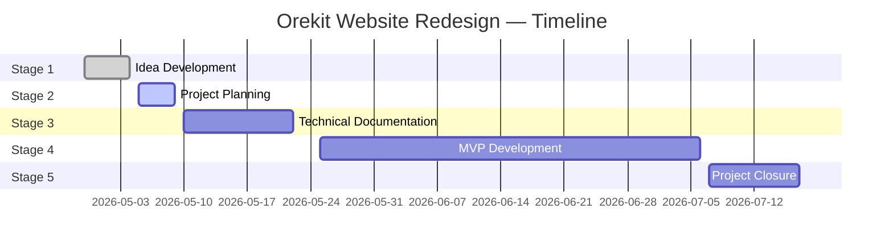

# 🛰️ Orekit Website Redesign – Stage 2 Report
> Project Planning

---

## 📅 Main Project Planning

---

## 🔧 Detailed Phase Planning

### Phase 1 — Foundations (W2–W3 · May 10–22)

| Step | Description |
|------|-------------|
| Step 1 | Create the GitLab repository · set up the folder structure (`frontend/`, `backend/`, `infra/`, `docs/`) |
| Step 2 | Set up Docker Compose · configure Nuxt 3, FastAPI, and PostgreSQL local environment (one-command stack) |
| Step 3 | Configure CI/CD pipeline on GitLab (lint + frontend build artefact + backend Docker image published) |
| Step 4 | "Hello world" frontend (Nuxt 3) and backend (FastAPI `/health`) building and passing CI |
| Step 5 | Protect `main` and `develop` branches · set up branch naming conventions |
| Step 6 | Create `.env.example` with all required variables · initialize `docs/RUNBOOK.md` |

---

### Phase 2 — Core product: Landing + 3D + Backend (W4–W8 · May 25–July 3)

> Les deux pistes avancent en parallèle avec une sync hebdomadaire pour aligner le contrat API. Pas de démo formelle intermédiaire.

**Piste backend**

| Step | Description |
|------|-------------|
| Step 1 | Design and implement the PostgreSQL TLE schema + Alembic migrations |
| Step 2 | Develop the Celestrak ingestion service (cron job, configurable source groups — requirement T-4) |
| Step 3 | Develop and document the public read-only REST API (FastAPI + OpenAPI spec) |
| Step 4 | Propose and get sign-off from Vincent on the API URL prefix *(requirement A-7 — before first frontend ↔ backend integration commit)* |

**Piste frontend**

| Step | Description |
|------|-------------|
| Step 5 | Collect 3–4 visual landing references · validate direction with Vincent |
| Step 6 | Build an isolated CesiumJS prototype · validate rendering performance |
| Step 7 | Redesign the landing page: live 3D viewer as hero (requirement LP-1, V-1), used-by carousel, sponsors section, news preview |
| Step 8 | Integrate the `SatelliteViewer.vue` component with the live TLE API |

**Validation de fin de phase**

| Step | Description |
|------|-------------|
| Step 9 | Run API load test (target: < 500ms p95) · run Lighthouse on landing (target: score ≥ 80) |
| Step 10 | End-of-phase demo: complete landing page + CesiumJS globe connected to the live TLE API |

---

### Phase 3 — Orekit Pages Migration (W9–W10 · July 6–17)

| Step | Description |
|------|-------------|
| Step 1 | Audit all existing Orekit static pages (overview, governance, publications, license, community, download, support, resources, doc-*) |
| Step 2 | Migrate all static pages to Nuxt 3 · validate with a full URL audit (zero 404s) |
| Step 3 | Version-aware download/doc pages reading the YAML versions file |
| Step 4 | Confirm Rugged URLs still resolve via the legacy Jekyll mechanism |
| Step 5 | *(Stretch)* Write the automated migration script (Jekyll markdown → `@nuxt/content` format) for the 117 Orekit blog posts |
| Step 6 | *(Stretch)* Migrate 117 Orekit blog posts · regenerate Atom and RSS feeds · validate with URL audit |

---

### Phase 4 — Hardening + Handover (W11 · July 18–19)

> ⛔ No new features after July 17 (end of Phase 3).

| Step | Description |
|------|-------------|
| Step 1 | Walk through the OWASP Top 10 checklist end-to-end |
| Step 2 | Finalize `docs/security.md` (security checklist + one-page threat model if time allows — S-16 optional) |
| Step 3 | Finalize `docs/RUNBOOK.md` (applicative scenarios: env variables, applying migrations, adding/removing a TLE source group, inspecting ingestion failure logs) |
| Step 4 | Finalize `docs/data-model.md`, `docs/api.md`, and OpenAPI spec |
| Step 5 | Transfer repo and CI access to Vincent *(infrastructure access not applicable — charter §7)* |
| Step 6 | Archive the final demo recording in the repository |
| Step 7 | Submit Stage 5 — Project Closure Report *(July 19, 2026)* |

---

## ✅ Milestone Summary

| Milestone | Date | Deliverable |
|---|---|---|
| ✅ Stage 1 complete | May 4, 2026 | Stage 1 Report submitted + QA review requested |
| 🔄 Stage 2 complete | May 9, 2026 | This document |
| Stage 3 complete | May 22, 2026 | Technical documentation finalized |
| Foundations demo | May 22, 2026 | CI green · hello world frontend + backend building |
| Core product demo | July 3, 2026 | TLE API artefacts published · CesiumJS globe on landing · A-7 signed off |
| Pages migration demo | July 17, 2026 | All Orekit static pages migrated · zero 404s · Rugged URLs intact |
| ⛔ Code freeze | July 17, 2026 | No new features after this date |
| Hardening + Handover | July 19, 2026 | Security checklist complete · runbook finalized · repo + CI access transferred |
| Stage 5 closure | July 19, 2026 | Project Closure Report submitted |
| Holberton exam | July 21, 2026 | End of formation |

---

## 📋 Cutover Criteria

The switch of `www.orekit.org` to the new stack is performed **by the maintainer only**, after all of the following conditions are met:

- [ ] All `S-*` and `P-*` requirements green or waived in writing by Vincent
- [ ] CI pipeline produces a frontend static artefact and a backend Docker image reproducibly on demand
- [ ] Runbook (`docs/RUNBOOK.md`) covers all applicative scenarios listed in the handover checklist (charter §7)
- [ ] Repo and CI access transferred to Vincent
- [ ] Legacy Jekyll build kept warm on `ganymede.orekit.org` for a rollback window (≥ 7 days recommended) — at the maintainer's discretion
