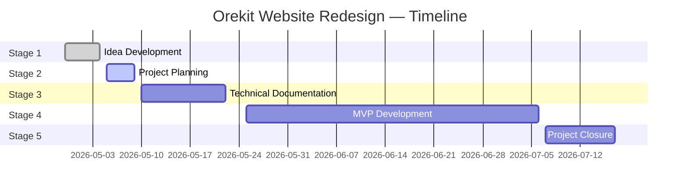

# 🛰️ Orekit Website Redesign – Stage 2 Report
> Project Planning

---

## 📅 Main Project Planning

---

## 🔧 Detailed Phase Planning

### Phase 1 — Foundations (W2–W3 · May 10–22)

| Step | Description |
|------|-------------|
| Step 1 | Create the GitLab repository · set up the folder structure (`frontend/`, `backend/`, `infra/`, `docs/`) |
| Step 2 | Set up Docker Compose · configure Nuxt 3, FastAPI, and PostgreSQL local environment (one-command stack) |
| Step 3 | Configure CI/CD pipeline on GitLab (frontend build + backend deploy) |
| Step 4 | Configure Caddy reverse proxy + automatic HTTPS on staging host |
| Step 5 | "Hello world" frontend (Nuxt 3) and backend (FastAPI `/health`) reachable through the staging reverse proxy |
| Step 6 | Protect `main` and `develop` branches · set up branch naming conventions |
| Step 7 | Create `.env.example` with all required variables · initialize `docs/RUNBOOK.md` |

---

### Phase 2 — Content Migration (W4–W6 · May 25–June 12)

| Step | Description |
|------|-------------|
| Step 1 | Audit all existing Orekit pages and 117 blog posts (Jekyll frontmatter mapping) |
| Step 2 | Write an automated migration script (Jekyll markdown → Nuxt `@nuxt/content` format) |
| Step 3 | Migrate all static pages: landing, overview, governance, publications, license, community, download, support, resources |
| Step 4 | Migrate 117 Orekit blog posts · validate with a full URL audit (zero 404s) |
| Step 5 | Regenerate Atom and RSS feeds in Nuxt 3 |
| Step 6 | Version-aware download/doc pages reading the YAML versions file |
| Step 7 | Confirm Rugged URLs still resolve via the legacy Jekyll mechanism |
| Step 8 | Propose and get sign-off from Vincent on the API URL prefix *(requirement A-7 — before end of W6)* |

---

### Phase 3 — Backend + Viewer + Landing (W7–W9 · June 15–July 6)

| Step | Description |
|------|-------------|
| Step 1 | Design and implement the PostgreSQL TLE schema + Alembic migrations |
| Step 2 | Develop the Celestrak ingestion service (cron job, configurable source groups) |
| Step 3 | Develop and document the public read-only REST API (FastAPI + OpenAPI spec) |
| Step 4 | Build an isolated CesiumJS prototype · validate rendering performance |
| Step 5 | Integrate the `SatelliteViewer.vue` component with the live TLE API |
| Step 6 | Redesign the landing page (hero, used-by carousel, sponsors section, news preview) |
| Step 7 | Run API load test (target: < 500ms p95) · run Lighthouse on landing (target: score ≥ 80) |

---

### Phase 4 — Hardening + Handover (W10–W11 · July 7–19)

> ⛔ No new features after July 6 (code freeze — Holberton deadline).

| Step | Description |
|------|-------------|
| Step 1 | Walk through the OWASP Top 10 checklist end-to-end |
| Step 2 | Finalize `docs/security.md` (security checklist + one-page threat model) |
| Step 3 | Configure automated PostgreSQL backups (cron) |
| Step 4 | Perform the backup restore drill end-to-end with Vincent *(requirement S-11)* |
| Step 5 | Finalize `docs/RUNBOOK.md` (all scenarios: deploy, rollback, restore, secret rotation, add TLE source, scale up) |
| Step 6 | Finalize `docs/data-model.md`, `docs/api.md`, and OpenAPI spec |
| Step 7 | Transfer credentials to Vincent: SSH key, DNS provider, GitLab admin *(requirement O-10)* |
| Step 8 | Archive the final demo recording in the repository |
| Step 9 | Submit Stage 5 — Project Closure Report *(July 19, 2026)* |

---

## ✅ Milestone Summary

| Milestone | Date | Deliverable |
|---|---|---|
| ✅ Stage 1 complete | May 4, 2026 | Stage 1 Report submitted + QA review requested |
| 🔄 Stage 2 complete | May 9, 2026 | This document |
| Stage 3 complete | May 22, 2026 | Technical documentation finalized |
| Foundations demo | May 22, 2026 | Staging live · CI green · hello world frontend + backend |
| Content Migration demo | June 12, 2026 | 117 posts migrated · all pages live on staging · A-7 signed off |
| Backend + Viewer demo | July 6, 2026 | TLE API live · CesiumJS globe rendering · landing redesigned |
| ⛔ Code freeze | July 6, 2026 | No new features after this date |
| Hardening + Handover demo | July 19, 2026 | Runbook complete · restore drill done · credentials transferred |
| Stage 5 closure | July 19, 2026 | Project Closure Report submitted |
| Holberton exam | July 21, 2026 | End of formation |

---

## 📋 Cutover Criteria

The switch of `www.orekit.org` to the new stack is performed **by the maintainer only**, after all of the following conditions are met:

- [ ] All `S-*`, `O-*`, `P-*` requirements green or waived in writing by Vincent
- [ ] Backup restore drill performed end-to-end and attested *(S-11)*
- [ ] Staging stable without human intervention for at least **7 days**
- [ ] Runbook reviewed and dry-run of the cutover procedure completed without incident
- [ ] Legacy Jekyll build kept warm on `ganymede.orekit.org` for ≥ 7 days post-cutover
