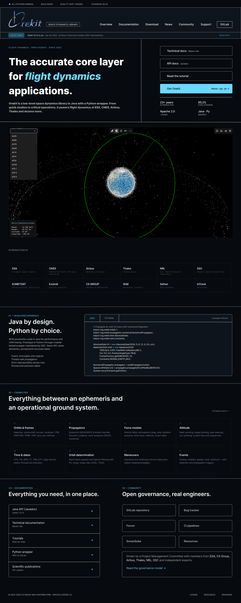
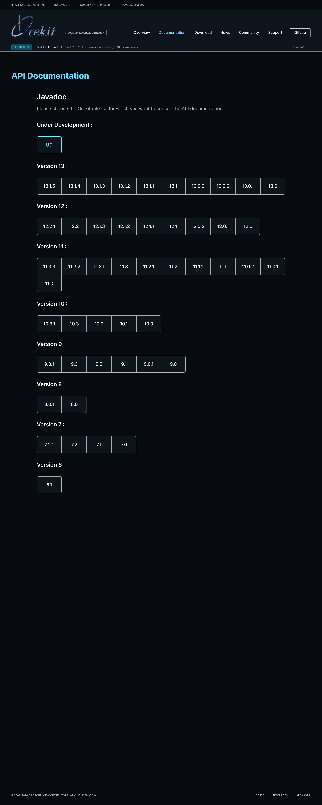
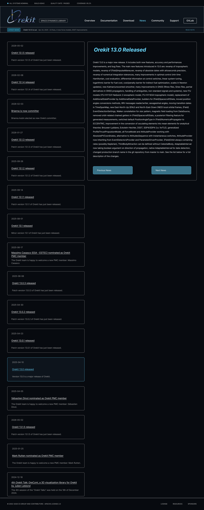

# Orekit Website Redesign – Stage 3 Report
> Technical Documentation

---

## 1. User Stories and Mockups

### User Stories

Prioritized using **MoSCoW** (Must Have / Should Have / Could Have / Won't Have).

#### Must Have

| ID    | User Story |
|-------|------------|
| US-1  | As a **new visitor**, I want to see a live 3D globe showing satellite positions on the landing page, so that I immediately understand what Orekit does. |
| US-2  | As a **new visitor**, I want to navigate all Orekit pages (overview, governance, download, documentation, community), so that I can find the information I need. |
| US-3  | As a **developer**, I want to query a public REST API to retrieve the latest TLEs for a satellite or a group, so that I can integrate orbital data into my own tools. |
| US-4  | As a **developer**, I want to access an OpenAPI specification, so that I can understand the API contract without reading the source code. |
| US-5  | As a **maintainer**, I want the CI pipeline to produce a static frontend artefact and a backend Docker image on every push, so that I can deploy a known-good build at any time. |
| US-6  | As a **maintainer**, I want a runbook covering environment variables, migrations, and ingestion configuration, so that I can operate the stack without asking the team. |

#### Should Have

| ID    | User Story |
|-------|------------|
| US-7  | As a **visitor**, I want to see a "used by" carousel of organisations and a sponsors section, so that I can assess the credibility and backing of the project. |
| US-8  | As a **visitor**, I want to browse Orekit blog posts and news, so that I can follow the project's progress. |
| US-9  | As a **visitor**, I want to subscribe to an Atom or RSS feed, so that I receive updates in my feed reader. |
| US-10 | As a **visitor**, I want to browse version-aware download and documentation pages, so that I can find the artefacts for the version I use. |

#### Could Have

| ID    | User Story |
|-------|------------|
| US-11 | As a **visitor using the 3D viewer**, I want to click a satellite to see its name, NORAD ID, and sub-satellite point, so that I can identify what I am looking at. |
| US-12 | As a **visitor**, I want to share a URL that focuses the 3D viewer on a specific satellite, so that I can point a colleague directly to it. |

#### Won't Have (v1)

- Admin UI for blog posts
- Authentication / user accounts
- Real-time WebSocket updates
- Mobile application
- Analytics or third-party trackers

---

### Mockups

The following wireframes describe the layout and structure of the main screens. Pixel-accurate designs are maintained in the team's shared Figma workspace; the descriptions below are the authoritative structural contract for implementation.

#### Landing Page (`/`)



Key constraints:
- The CesiumJS viewer is loaded on first paint — no lazy-load gate (V-10).
- The hero viewer is the first element below the navbar (LP-1, V-1).
- The carousel auto-advances, pauses on hover/focus, has an explicit play/pause button, and respects `prefers-reduced-motion` (LP-4).
- Every logo has an `alt` attribute; colour contrast meets WCAG AA (LP-8).

---

#### API Documentation (`/doc-javadoc`)



---

#### News Index (`/news`) — stretch goal



---

## 2. System Architecture

### High-Level Diagram

```
                            Internet
                               │
                          (HTTPS, 443)
                               │
                  ┌────────────▼────────────┐
                  │   Reverse proxy + TLS   │   ← operated by the maintainer
                  └─────┬──────────────┬────┘     (out of student scope)
                        │              │
              /api/*    │              │  / (everything else)
                        │              │
              ┌─────────▼───┐    ┌─────▼──────────────────────┐
              │  Backend    │    │  Static site on disk        │
              │  (FastAPI)  │    │  (rsync target, CI artefact)│
              └──────┬──────┘    └────────────────────────────┘
                     │
              ┌──────▼──────┐
              │ PostgreSQL  │
              │  Database   │
              └─────────────┘
                     ▲
             ┌───────┴────────┐
             │  TLE ingestion │
             │  (cron job)    │
             └───────┬────────┘
                     │
              ┌──────▼──────┐
              │  Celestrak  │   ← external TLE source (public, no auth)
              └─────────────┘
```

**Three artefacts delivered by the team to the maintainer:**

1. **Static site** - output of the Nuxt 3 static generation step, published as a CI artefact.
2. **Backend container image** - published to a registry accessible to the maintainer.
3. **Database migrations** (Alembic) + a complete `.env.example`.

Reverse proxy, TLS termination, hosting, backups, and production deployment are operated by the maintainer and are out of student scope (spec §13, charter §3).

### Data Flow

| Flow | Description |
|------|-------------|
| Browser -> Static site | Visitor requests are served directly from disk by the reverse proxy. No server-side rendering. |
| Browser -> Backend API | Requests to `/api/*` are proxied to the FastAPI service. All endpoints are read-only. |
| Frontend -> Backend | `GlobeEmbed.vue` fetches the TLE list from `GET /api/tle` on page load. Client-side SGP4 propagation via `satellite.js`. |
| Cron -> Celestrak -> DB | The ingestion job fetches TLE groups from Celestrak on a schedule and upserts records into PostgreSQL. |

---

## 3. Components, Classes, and Database Design

### Frontend Components (Nuxt 3 / Vue 3)

| Component | File | Description |
|-----------|------|-------------|
| `GlobeEmbed.vue` | `apps/web/app/components/GlobeEmbed.vue` | CesiumJS globe. Fetches TLE list from the API on mount, propagates positions client-side with `satellite.js`, renders time-dynamic entities. Loaded on first paint, no lazy-load gate (V-10). |
| `AppNav.vue` | `apps/web/app/components/AppNav.vue` | Global navigation bar. Responsive, keyboard-navigable. Includes GitHub link and community dropdown. |

### Backend Modules (FastAPI / Python)

| Module | File | Description |
|--------|------|-------------|
| `Tle` | `apps/api/models.py` | SQLAlchemy 2 model. Fields: `id` (PK), `satellite_id` (str), `name` (str), `line1` (char 69), `line2` (char 69), `source_group` (str), `ingested_at` (datetime). Unique constraint on `(satellite_id, source_group)` - upsert on conflict (D-4). |
| `ingest()` | `apps/api/ingest.py` | Reads the configured group list from environment variables (T-4). Fetches each group from Celestrak with exponential backoff and a hard retry cap (T-2). Upserts records via bulk merge. Logs a clearly-marked `ERROR` line on persistent failure (T-3). |
| TLE routes | `apps/api/main.py` | FastAPI routes for `/api/tle` and `/api/tle/{satellite_id}`. No write endpoints (A-6). Input validation via Pydantic; parameterised queries only (S-7). |
| Health route | `apps/api/main.py` | `GET /health` - checks DB reachability and returns service status (A-1). |
| Configuration | `apps/api/main.py` + `os.environ` | All configuration loaded from environment variables via `os.environ`. Never hard-codes secrets. |

### Database Schema

```
┌─────────────────────────────────────────────────────────────┐
│  TABLE: tle                                                 │
├───────────────┬──────────────────┬──────────────────────────┤
│  Column       │  Type            │  Constraints             │
├───────────────┼──────────────────┼──────────────────────────┤
│  id           │  SERIAL          │  PRIMARY KEY             │
│  satellite_id │  VARCHAR(20)     │  NOT NULL                │
│  name         │  VARCHAR(255)    │  NOT NULL                │
│  line1        │  CHAR(69)        │  NOT NULL                │
│  line2        │  CHAR(69)        │  NOT NULL                │
│  source_group │  VARCHAR(100)    │  NOT NULL                │
│  ingested_at  │  TIMESTAMPTZ     │  NOT NULL, DEFAULT NOW() │
├───────────────┴──────────────────┴──────────────────────────┤
│  UNIQUE (satellite_id, source_group)                        │
│  INDEX ON (source_group)                                    │
└─────────────────────────────────────────────────────────────┘
```

**Uniqueness rule:**\
one row per `(satellite_id, source_group)`, updated in-place on each successful ingestion run (`INSERT … ON CONFLICT (satellite_id, source_group) DO UPDATE SET line1 = …`). This bounds storage growth to fewer than 50 rows for the default group set and tolerates duplicate fetches without blowing up storage (D-4, D-5).

**Index strategy:**
- Primary key on `id` - internal reference.
- Unique index on `(satellite_id, source_group)` - enforces the uniqueness rule and supports the `GET /api/tle/{satellite_id}` point lookup (D-2).
- Index on `source_group` alone - supports the group-filter list query (D-3).

**Retention policy:**\
upsert-only; no append-only rows, no scheduled purge. Storage is bounded by the number of distinct `(norad_id, source_group)` pairs in the configured group set.

**Migrations:**\
all schema changes through versioned Alembic migrations; no manual SQL on production (D-6). Migration files live in `apps/api/alembic/versions/`.

---

## 4. Sequence Diagrams

### UC-1 — Visitor loads the landing page

```
Browser          Static Site (disk)     Backend (FastAPI)     PostgreSQL
   │                    │                       │                   │
   │── GET / ──────────►│                       │                   │
   │◄── HTML + JS ──────│                       │                   │
   │   (CesiumJS bundle, satellite.js)          │                   │
   │                    │                       │                   │
   │── Mount GlobeEmbed.vue ───────────────────────────────────────────
   │                    │                       │                   │
   │── GET /api/tle?group=stations ────────────►│                   │
   │                    │                       │── SELECT … ──────►│
   │                    │                       │◄── TLE rows ──────│
   │◄── 200 JSON list ──────────────────────────│                   │
   │                    │                       │                   │
   │── propagate positions (satellite.js SGP4) ──────────────────────
   │── render 3D globe (CesiumJS) ───────────────────────────────────
```

---

### UC-2 — TLE ingestion cron job

```
Cron       ingest.py             Celestrak        PostgreSQL
  │               │                  │                │
  │── trigger() ─►│                  │                │
  │               │                  │                │
  │               │  (for each configured group)      │
  │               │── GET /NORAD/elements/… ─────────►│ (Celestrak)
  │               │◄── TLE lines ─────────────────────│
  │               │── UPSERT ON CONFLICT ────────────►│ (PostgreSQL)
  │               │◄── OK ────────────────────────────│
  │               │                  │                │
  │               │  (on fetch failure — retry with backoff up to cap)
  │               │── GET … (retry) ─────────────────►│
  │               │  … (cap reached)                  │
  │               │── log ERROR: ingestion failed for group <X>
```

---

### UC-3 — Developer queries a specific satellite

```
Client          Backend (FastAPI)      PostgreSQL
  │                    │                   │
  │── GET /api/tle/25544 ─────────────────►│
  │                    │── SELECT … WHERE satellite_id = '25544' ──►│
  │                    │◄── row (or empty) ─────────────────────────│
  │                    │                   │
  │  if found:         │                   │
  │◄── 200 JSON { satellite_id, name, line1, line2, ingested_at } ──│
  │                    │                   │
  │  if not found:     │                   │
  │◄── 404 { "detail": "Satellite not found" } ─────────────────────│
```

---

## 5. API Specifications

### External APIs

| API | Endpoint pattern | Usage | Why chosen |
|-----|-----------------|-------|-----------|
| **Celestrak** | `https://celestrak.org/NORAD/elements/gp.php?GROUP=<group>&FORMAT=tle` | TLE ingestion source | Public, no registration required, long running reliable source, standard two-line element format; the de-facto community standard for satellite TLE data. |

No other external runtime APIs are used. The CesiumJS Ion service is not used the viewer runs against the open-source CesiumJS library with a self-hosted or Bing-fallback terrain provider.

### Internal REST API

Base path: `/api` validated and signed off by the maintainer before the first frontend <-> backend integration commit (requirement A-7).

| ID  | Method | Path | Description | Query / Path params | Success response | Error responses |
|-----|--------|------|-------------|---------------------|-----------------|-----------------|
| A-1 | `GET` | `/api/health` | Service liveness + DB reachability | — | `200 { "status": "ok", "db": "ok" }` | `503 { "status": "degraded", "db": "error" }` |
| A-2 | `GET` | `/api/tle` | List latest TLEs. Optional filter by source group. Default limit 100 records, configurable via `?limit=` and `?offset=`. | `?group=<str>`, `?limit=<int>`, `?offset=<int>` (all optional) | `200 [ { satellite_id, name, line1, line2, source_group, ingested_at }, … ]` | `422` on invalid params |
| A-3 | `GET` | `/api/tle/{satellite_id}` | Latest TLE for one satellite | Path: `satellite_id` (str) | `200 { satellite_id, name, line1, line2, source_group, ingested_at }` | `404 { "detail": "Satellite not found" }` |
| A-5 | `GET` | `/api/openapi.json` | OpenAPI 3.1 specification | — | `200` OpenAPI JSON document | — |

All endpoints are **public read-only** no write endpoint, no authentication header required (A-6).

**Example response `GET /api/tle/25544`:**
```json
{
  "satellite_id": "25544",
  "name": "ISS (ZARYA)",
  "line1": "1 25544U 98067A   25015.50000000  .00001234  00000-0  12345-4 0  9999",
  "line2": "2 25544  51.6400 123.4567 0001234  45.6789 314.3210 15.49012345678901",
  "source_group": "stations",
  "ingested_at": "2025-01-15T12:00:00Z"
}
```

The full OpenAPI specification (auto-generated by FastAPI) is accessible at `/api/openapi.json` when the service is running and is archived as `docs/openapi.json` in the repository.

---

## 6. SCM and QA Strategies

### Source Control Management (SCM)

**Tool:** Git, hosted on GitHub.

**Branching model:**

```
main         ← stable, protected; reflects the last state accepted by the maintainer
  └─ dev     ← integration branch, protected; merged into main after maintainer sign-off
       ├─ Virginie                   ← Virginie's working branch (backend)
       ├─ Allix                      ← Allix's working branch (frontend)
       ├─ feat/<short-description>   ← one branch per feature, created from dev
       ├─ fix/<short-description>    ← bug fix branch
       └─ chore/<short-description>  ← tooling / CI / docs
```

**Rules:**
- No direct push to `main` or `dev` - changes go through Pull Requests (PRs).
- Every PR requires at least one reviewer approval before merge.
- PR title follows conventional commit format: `feat:`, `fix:`, `chore:`, `docs:`, `refactor:`.
- Feature branches are deleted after merge to keep the remote clean.
- The legacy Jekyll source (`_posts/`, `_layouts/`, etc.) remains in place on all branches during the project (L-3).

**Commit hygiene:**
- Short imperative subject line (≤ 72 chars), conventional prefix.
- No secrets, no generated files, no large binaries committed.
- `.env` files are gitignored; only `.env.example` is committed.

---

### QA Strategy

#### Testing

| Layer | Tool | Type | Scope |
|-------|------|------|-------|
| Backend | `pytest` + `httpx` | Unit + integration | API endpoint contracts, ingestion logic, DB upsert behaviour - run against a real PostgreSQL service container in CI (not mocked) |
| Backend | `pytest` | Unit | `IngestionService` retry / backoff logic, error logging path |
| Frontend | `vitest` | Unit | Pure utility functions: SGP4 wrapper, YAML content parsing, version sorting |
| Frontend | Manual + Lighthouse | Functional / performance | Landing page golden path, 3D viewer rendering on a representative laptop; Lighthouse score target ≥ 80 |
| API | Manual via OpenAPI UI (`/api/docs`) | Smoke | All endpoints verified before each milestone demo |

**No mocked database in integration tests.** The CI pipeline starts a PostgreSQL service container so tests run against a real engine. This avoids divergence between test and production SQL behaviour.

#### CI Pipeline Gates (GitHub Actions — `.github/workflows/ci.yml`)

| Job | Trigger | Fails on |
|-----|---------|----------|
| `lint` | Every push | Ruff linting errors on backend code (C-2) |
| `test` | Every push | Any failing pytest; runs with a real PostgreSQL service container with testcontainers (C-3) |
| `build` | Every push | Docker image build failure; image published to `ghcr.io` (C-4) |

No deployment job, the team publishes artefacts only. The maintainer deploys (charter §3, spec §13).

---

## 7. Technical Justifications

| Decision | Requirement(s) | Justification |
|----------|---------------|---------------|
| **Nuxt 3 in static-generation mode** | L-1, L-3, LP-*, school JS framework requirement | Gentle learning curve for a 2-person team with limited time budget. File-based routing reduces boilerplate. Static output eliminates server-side attack surface and produces a simple rsync-deployable artefact matching the maintainer's existing workflow. SSR is explicitly excluded (charter §3). |
| **`@nuxt/content` v2** | US-8, US-9, LP-6 | Markdown-first CMS layer; frontmatter schema maps 1-to-1 with existing Jekyll posts, making the blog migration scripted and reversible. Built-in query API enables the news index and feed generation without a separate service. |
| **CesiumJS** | V-1, V-2, V-3, V-10 | Only open-source JavaScript library with built-in WGS84 globe, time-dynamic entity rendering, and satellite ground-track support. The team must justify in writing any deviation from this recommendation before the end of week 2 (V-2). |
| **satellite.js** | V-2, V-3 | Lightweight in-browser SGP4/SDP4 propagator. Runs entirely client side, no server round-trip per animation frame. Widely used and maintained. Deviation requires the same written justification as CesiumJS. |
| **FastAPI (Python 3.11+)** | A-5, S-7, school database requirement | Auto-generates the OpenAPI specification at zero extra cost (A-5). Pydantic validates all input at the API boundary (S-7). Python is the natural runtime for a future integration of the Orekit Python wrapper (charter §4 v2 roadmap) without a rewrite. |
| **SQLAlchemy 2 + Alembic** | D-6, S-7 | Industry-standard ORM; parameterised queries prevent SQL injection by construction (S-7). Alembic provides versioned, repeatable migrations, no manual SQL on production (D-6). |
| **PostgreSQL 15** | D-4, school database requirement | Satisfies the school's relational-database requirement. Native `INSERT … ON CONFLICT DO UPDATE` handles duplicate ingestion cleanly and atomically (D-4). Widely operated; the maintainer is already familiar with it. |
| **Docker + GitHub Actions artefacts** | C-4, charter §6 cutover criterion 2 | Reproducible builds independent of developer workstation state. The maintainer can deploy any tagged image without rebuilding from source. Matches the existing `rsync` based deploy pattern for the static frontend. |
| **Celestrak as TLE source** | T-1, T-4 | Public, no registration or API key required (no secret to manage). Long running, reliable, standard TLE format. The standard choice in the astrodynamics community and referenced by the Orekit documentation itself. |
| **No SSR, no WebSocket, no admin UI** | charter §3 (explicit exclusions) | These features would multiply the attack surface, operational complexity, and time budget. The school requirement is satisfied by the database backed backend alone. Static generation is safer to operate and sufficient for the content model. |
| **No deployment in student scope** | charter §3, spec §13 | Reverse proxy, TLS, hosting, and backups are the maintainer's responsibility. The team delivers three typed artefacts (static build, container image, migrations + `.env.example`) and a runbook. This reduces risk of misconfiguration of production infrastructure by junior contributors. |
